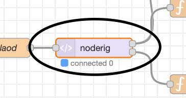

# NodeRig install for Raspberry Pi and Linux in general

## Install node.js

First thing is to install node.js: 

Navigate to nodejs.org’s [download page](https://nodejs.org/en/download/).

The easiest way is to use a package manager based on your platform.
Here’s a [link](https://nodejs.org/en/download/package-manager/) to the nodejs.org website for installing using a package manager.

Node-RED recomends nodejs 12.x, but supports 14.x so I’ve opted to use nodejs LTS 14.x from [NodeSource](https://github.com/nodesource/distributions/blob/master/README.md#debinstall).  I've developed on both.

## Install Node-RED

Next step is to install Node-RED:

Here’s the [link](https://nodered.org/docs/getting-started/local) to Node-RED’s install page.

Install Node-RED globally.  The version I got just how is 1.2.9.

From the command line type ‘node-red’.  Wait for the message about Started flows.  Press control-C to exit Node-Red.

Next change directory to ~/.node-red

Install additional packages required by NodeRig:

     npm i vue bootstrap-vue @popperjs/core ajv lodash

Don’t worry about the warning for jquery, it doesn’t get used by NodeRig.

Next run node-red again and open a browser with [http://localhost:1880](http://localhost:1880).  Click on the hamburger menu at the top right and click on ‘Manage palette’.  Click on install and install the following Node-RED packages:  

     node-red-node-serialport
     node-red-contrib-uibuilder

Next, exit Node-RED (control-C) and make a copy of the settings.js file (in ~/.node-red):

     cp settings.js settings.js-orig

Apply the following patch to settings.js:
```diff
--- settings.js-orig	2021-01-18 08:35:16.417432800 -0800
+++ settings.js	2021-02-10 18:15:27.264486600 -0800
@@ -238,6 +238,8 @@
         // os:require('os'),
         // jfive:require("johnny-five"),
         // j5board:require("johnny-five").Board({repl:false})
+        _: require('lodash'),
+        Ajv: require('ajv').default,
     },
     // `global.keys()` returns a list of all properties set in global context.
     // This allows them to be displayed in the Context Sidebar within the editor.
@@ -254,11 +256,10 @@
     // provided here will enable file-based context that flushes to disk every 30 seconds.
     // Refer to the documentation for further options: https://nodered.org/docs/api/context/
     //
-    //contextStorage: {
-    //    default: {
-    //        module:"localfilesystem"
-    //    },
-    //},
+    contextStorage: {
+        persist: { module:"localfilesystem" },
+        default: { module: "memory" },
+    },

     // The following property can be used to order the categories in the editor
     // palette. If a node's category is not in the list, the category will get
@@ -290,7 +291,7 @@
     editorTheme: {
         projects: {
             // To enable the Projects feature, set this value to true
-            enabled: false
+            enabled: true
         }
     }
 }
 ```

Run node-red again and refresh your browser.
You will get a dialog box about projects under Node-RED.
Click on the ‘Clone Repository’ button.
Enter your name and email addrress and click Next.

Enter ‘noderig’ as the Project Name and ‘https://github.com/n7get/noderig.git’ in the Get Repository URL.  
Don’t enter anything in the Username/password fields unless you have a login already on GitHub.  
Click Next.

You should now see a whole bunch of 'flows' like:


Click on the 'UI' tab near the top of the page, you sould see this:


Double click on the 'noderig' node:



You'll see 'Edit uibuilder node' at the top.  Click on the 'Manage front-end libraries' button.  Under the list of installed packages, click the +.  Enter 'http-vue-loader' and click Install.  You can now click Done at the top.

## Running NodeRig

Almost there!  In the ‘~/.node-red/projects/noderig’ drectory, there are a couple of scripts that will be useful.  

The first, files/start_pts, creates a pair or pseudo ttys that will be used by the digital application (Winlink/fldigi, et al.) to connect to what it thinks is the rig, but it is really the NodeRig program.  
The start_pts script will create two ttys, /dev/tty98 and /dev/tty99.  
NodeRig will connect to /dev/tty98 and digital app will connect to /dev/tty99.

The ttys are picked up by NodeRig via environment variables, with RIG_TTY specifing the rig's tty and APP_TTY the digital app's.
A script, files/nr, is a simple script to set the ttys and run node-red.  
On my systems the enhanced serial USB appears /dev/USB0.  
If your USB tty is different, edit nr to reflect your actual port.  

Open a a browser window on [NodeRig](http://localhost:1880/noderig).
