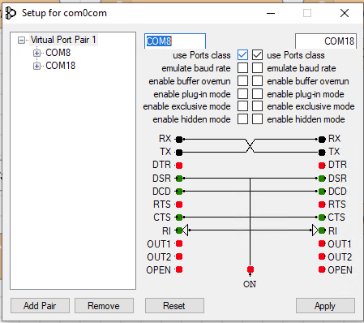

# NodeRig install for Windows 10

## Install git

Open a browser on git's Windows 10 [download page](https://git-scm.com/download/win).  Download and install using the defaults.

## Install node.js

Open a browser on nodejs.org's [download page](https://nodejs.org/en/download/).

I've installed this using the default settings as well.

Node-RED recommends nodejs 12.x, but supports 14.x so I've opted to use nodejs LTS 14.x from [NodeSource](https://github.com/nodesource/distributions/blob/master/README.md#debinstall).  I've developed on both.

## Install Node-RED

Next step is to install Node-RED:

Here's the [link](https://nodered.org/docs/getting-started/windows) to Node-RED's install page.

I followed their instructions and installed node-RED using:

`npm install -g --unsafe-perm node-red`

From the command line type 'node-red'.  Allow access when promted.  Wait for the message about Started flows.  Press control-C to exit Node-Red.

Next change directory to .node-red

Install additional packages required by NodeRig:

`npm i vue bootstrap-vue @popperjs/core ajv lodash`

Don't worry about the warning for jquery, it doesn't get used by NodeRig.

Next run node-red again and open a browser with [http://localhost:1880](http://localhost:1880).  Click on the hamburger menu at the top right and click on 'Manage palette'.  Click on install and install the following Node-RED packages:  

`node-red-node-serialport`

`node-red-contrib-uibuilder`

Next, exit Node-RED (control-C) and make a copy of the settings.js file (in ~/.node-red):

`copy settings.js settings.js-orig`

Copy and paste the following text into a file called settings.js.patch:
```diff
--- settings.js-orig	2021-01-18 08:35:16.417432800 -0800
+++ settings.js	2021-02-10 18:15:27.264486600 -0800
@@ -238,6 +238,8 @@
         // os:require('os'),
         // jfive:require("johnny-five"),
         // j5board:require("johnny-five").Board({repl:false})
+        _: require('lodash'),
+        Ajv: require('ajv').default,
     },
     // `global.keys()` returns a list of all properties set in global context.
     // This allows them to be displayed in the Context Sidebar within the editor.
@@ -254,11 +256,10 @@
     // provided here will enable file-based context that flushes to disk every 30 seconds.
     // Refer to the documentation for further options: https://nodered.org/docs/api/context/
     //
-    //contextStorage: {
-    //    default: {
-    //        module:"localfilesystem"
-    //    },
-    //},
+    contextStorage: {
+        persist: { module:"localfilesystem" },
+        default: { module: "memory" },
+    },

     // The following property can be used to order the categories in the editor
     // palette. If a node's category is not in the list, the category will get
@@ -290,7 +291,7 @@
     editorTheme: {
         projects: {
             // To enable the Projects feature, set this value to true
-            enabled: false
+            enabled: true
         }
     }
 }
 ```
Use the following command to apply the patch:

  `C:\"Program Files"\Git\usr\bin\patch -p0 < settings.js.patch`

Run node-red again and refresh your browser.
You will get a dialog box about projects under Node-RED.
Click on the 'Clone Repository' button.
Enter your name and email address and click Next.

Enter `noderig` as the Project Name and `https://github.com/n7get/noderig.git` in the Get Repository URL.  
Don't enter anything in the Username/password fields unless you have a login already on GitHub.  
Click Next.

You should now see a whole bunch of 'flows' like:


Click on the 'UI' tab near the top of the page, you should see this:


Double click on the 'noderig' node:


You'll see 'Edit uibuilder node' at the top.  Click on the 'Manage front-end libraries' button.  Under the list of installed packages, click the +.  Enter `http-vue-loader` and click Install.  You can now click Done at the top.

## Create a virtual serial port pair

A virtual serial port pair is used to allow a digital app to communicate with NodeRig as if it were the FT-991A.  I'm using a free program called `com0com`, you can download it from [here](http://com0com.sourceforge.net).

I've created a the virtual serial port pair on my system as COM8/COM18:



## Running NodeRig

Almost there!  

Right now, I'm still running NodeRig from the command prompt because I like to watch the log output from NodeRig.  Making NodeRig run as a service is on my TTD list.

NodeRig needs to know what physical and virtual com ports to connect to.  This is picked up by NodeRig via environment variables, with RIG_TTY specifying the rig's tty and APP_TTY the digital app's.

A script, `~/.node-red/projects/noderig/files/nr.cmd`, is a simple script to set the ttys and run Node-RED.  

On my systems the enhanced serial USB appears COM4.  
If your USB com port is different, edit `nr` to reflect your actual port.   

Open a a browser window on [NodeRig](http://localhost:1880/noderig).
