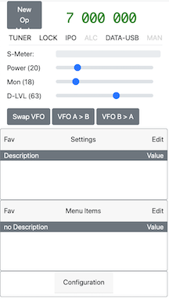

# NodeRig

Ham Radio ('rig') automation program for a Yaesu FT-991A. (so far).

## About

From the 'CAT Operation Reference Manual':

The CAT (Computer Aided Transceiver) System in the FT-991A transceiver provides control of frequency, VFO, memory, and other settings such as dual-channel memories and diversity reception using an external personal computer. This allows **multiple control operations to be fully automated** with single mouse clicks, or keystroke operations on the computer keyboard.

That in a nutshell is the purpose of this software.  It's not a remote control application, there are already high quality applications such as HRD, flrig, Win4Yaesu, et al.  This software all about freeing the operator from having to think about changing rig settings/menu items when switching between operating modes.  e.g. switching from voice SSB to picking up an email via 2M packet to sending an email via VARA HF to FM voice on a repeater.  One of the primary design goals is to have NodeRig working along side of Winlink Express to provide an efficient emergency communications platform.  **The bottom line is the purpose of NodeRig is to automate the radio and allow the operator to focus on getting the messages to where they are going.**

Right now NodeRig is *mostly* ‘read only’, i.e. you will need to use the rig to configure the settings/menu items and then save the settings you want to control on the app (Op Modes).  The plan is to eventually make it a complete control app so that the buttons and knobs on the rig are manual backups.  

NodeRig is also tested on a regular basis with Fldigi and WSJT-X.

## Features (incomplete)

* Automatically switches Op Modes based on any rig setting.  So it's been frequency and maybe mode == 'C4FM'.
* Shuts down rig if high SWR is detected
* Can declutter the UI by only showing the rig and menu settings of interest.
* Can show what changes to the rig's settings have been made since the last Op Mode was loaded.
* Unlimited memory channels.

## Installing NodeRig

First follow either [INSTaLL-RPi](/INSTALL-RPi.md) for Linux/RPi or [INsTALL-Windows](/INSTALL-Windows.md) for Window 10.  

Hopefully you'll see something like this:

## Initial Op Modes and Memory Channels

At this point you may want to import some starter Op Modes and Memory Channels to NodeRig.

Scroll to the bottom of the NodeRig page and click on 'Configuration'.  Click the 'Import Op Modes' and copy and paste the content of [Op Modes](/files/op_modes.json).  Same for Memory Channels, click on 'Import Memory Channels' and copy and paste [Memory Channels](files/memory_channels.json).  

## $.25 tour

Click on the frequency at the top and enter 7074, assuming your VFO A is not already not set to 7074000.  If it is, try 14074.  You should see the Op Mode, the square to the left of the frequency, change to FT8.

Double click the frequency and the list of memory channels will be displayed.

Click on the Op Mode and the list of Op Modes will be listed.  Clicking on an Op Mode will change the FT-991A to that Op Mode.  On the left side of the header is the edit button which will allow you to edit some of the non-rig settings of the Op Mode.  

I think I'm going to drop the Primary Op Mode feature as this didn't turn out to be as useful as I thought it would be.  Being able to load an Op Mode as part of a Memory Channel works better I think, but that's getting ahead of myself.

The Enable trigger will enable or disable evaluation of the trigger for this Op Mode.

The Order value specifies the order in which the Op Mode triggers are evaluated.  The idea is to have triggers for more specific criteria be evaluated before more general criteria, i.e. specific frequencies, such as those for FT8, should be evaluated before a broader range of frequencies, like 7044500 to 7185000 (my guess for a generic data frequency range, YMMV).

The timers will enable count up timer and count down timers on the UI during transmit, i.e. in the case of Op Modes for repeaters - enable count-down and enter the repeater's timeout value as the start time.  

Trigger is the a snippet of JavaScript code that is evaluated for every setting or menu item change.  So far the value of the VFO A is the most valuable setting and there's a few examples of triggers in the sample Op Modes JSON file.  I think mode could come in handy as well.

Back to the list of Op Modes - to the right of the header is the save button.  This is probably the most important button of the whole app.  

A couple of important notes are warranted here:

1. The app is still mostly 'read only', i.e. most of the settings and menu items will be set via the rig.
1. When you make changes to the Op Mode via the edit dialog or changes to the rig, **they are not saved until you click the save button on the Op Mode list pop up**.

Below the Op Mode and frequency line is a row of status indicators.  Most of these work when clicked.  Clicking on 'TUNER' will toggle the ATU on and off.  Same for 'LOCK'.  Clicking on IPO/AMP1/AMP2 will cycle the setting of the pre amp.  

Clicking on the 'ALC' indicator doesn't do anything right now.  While transmitting, when the ALC indicators is light grey, it means the ALC is at a good value.  If the ALC indicator goes black, it means the ALC is to high.

To the right of the ALC is the current mode.  Clicking on the mode will bring up a dialog so the current mode can be changed.

The MAN button enables/disables manual mode.  When manual mode is enabled, no Op Modes will be triggered.

Below the status line are various controls that I've implemented so far.  For the most part they do what they look like they should do.

Below that are the Settings and Menu Items boxes.  There are four views for the Setting/Menu Items boxes, Fav, All, Saved and Changed.  

Every Setting and Menu Item has two toggles associated with them.  Fav and Saved.  Fav and Saved can be toggled via the check boxes shown when the 'Edit' button is clicked.  When the Fav toggle is checked, that Setting or Menu Item will be displayed when in the Fav view.  The Saved toggle is the heart of NodeRig.  When Saved is clicked, that Setting/Menu Item will be saved **when the Op Mode is saved** and restored when the Op Mode is loaded.

The All view of the Settings/Menu Items boxes shows all the settings and Menu Items.  

The Saved view shows the Settings/Menu Items that have their Saved toggle checked.

The Changed view show the Settings/Menu Items that have changed since the last Op Mode was loaded.  I'm not happy with this one and it needs work.

Then the Configuration box has buttons for exporting and importing Op Modes and Memory Channels. This is also a work in progress.

That's it for now.  NodeRig is still in early stages of it's development, I'm hoping people will find it useful.

## Digital apps

Lots of items on my TTD list to document here ;-).

Briefly, set the digital app to use the 'other end' of the virtual com ports or the pseudo ttys.  Use CAT control and configure the rig as a FT-119A.  NodeRig ignores RTS/DTR, etc.

I know there's lots more to do, fix and document, but this is at least a start.

73, N7GET
